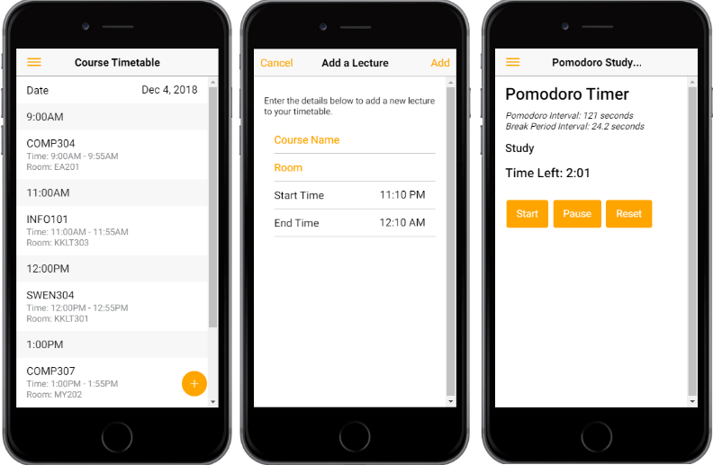

# University-Companion

For the 'Software Development for Mobile' undergraduate course, I implemented a university companion mobile application on two different occasions using two different mobile frameworks. The first was with the Ionic framework, and the second was with the React Native framework.

The app consists of a lecture timetable page where you can add, modify, and remove lectures to your timetable. It also consists of a pomodoro timer page which can be used freely to allocate your time for studying. The timer can be adjusted in the settings page. Finally, the app contains user authentication functionality via Google Firebase.

The source code has been imported from my private repository.

Screenshots of the app (Ionic implementation):

